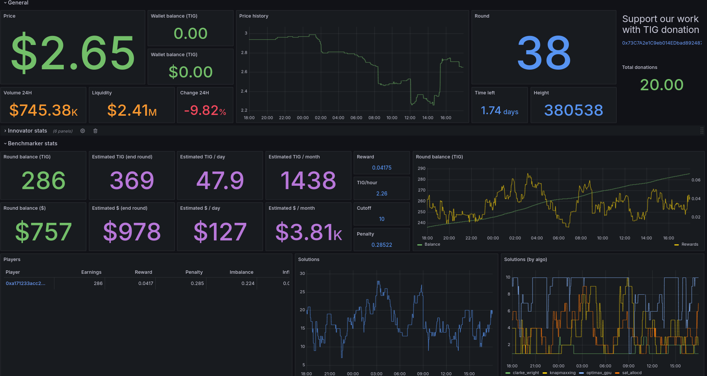

# The Innovation Game Dashboard

This project allows you to monitor your TIG nodes directly in Grafana, providing the necessary information and facilitating tracking.

https://github.com/tig-foundation/tig-monorepo



## Prerequisites

Depending on your setup, you can use Docker or a manual setup to install this dashboard.

You need:
* A Grafana server running 24/7
* A server to retrieve TIG data running 24/7 (can be the same as the Grafana server)

It is preferable to have your own Grafana server for monitoring your nodes. But you can use Grafana Cloud which will provide you with the necessary stack [https://grafana.com/](https://grafana.com/)

## Quick start <a id='quick_start'></a>

You can quickly install this dashboard using Docker.
If you don't want to use Docker, follow the manual instructions.

First, install Docker:

```
# Add Docker's official GPG key:
sudo apt-get update
sudo apt-get install ca-certificates curl
sudo install -m 0755 -d /etc/apt/keyrings
sudo curl -fsSL https://download.docker.com/linux/ubuntu/gpg -o /etc/apt/keyrings/docker.asc
sudo chmod a+r /etc/apt/keyrings/docker.asc

# Add the repository to Apt sources:
echo \
  "deb [arch=$(dpkg --print-architecture) signed-by=/etc/apt/keyrings/docker.asc] https://download.docker.com/linux/ubuntu \
  $(. /etc/os-release && echo "$VERSION_CODENAME") stable" | \
  sudo tee /etc/apt/sources.list.d/docker.list > /dev/null
sudo apt-get update

sudo apt-get install docker-ce docker-ce-cli containerd.io docker-buildx-plugin docker-compose-plugin
```

### Case #1: you don't have a grafana server

1. Prepare your environment
```
mkdir tig-dashboard
cd tig-dashboard
```

2. Create a settings file called ```settings.env``` with these parameters inside:
```
PLAYER_IDS='["a","b","d","d"]'
INNOVATOR_IDS='["e"]'
```
* PLAYER_IDS: list of your benchmarker addresses
* INNOVATOR_IDS: list of your innovator addresses

3. Install and run docker image
```
bash <(wget -qO- https://raw.githubusercontent.com/fpatron/tig-dashboard/master/docker/install_allinone.sh)
```

### Case #2: you have a grafana server

1. Prepare your environment
```
mkdir tig-dashboard
cd tig-dashboard
```

2. Create a settings file called ```settings.env``` with these parameters inside:
```
PROMETHEUS_URL=http://0.0.0.0:9090/api/v1/write
PLAYER_IDS='["a","b","d","d"]'
INNOVATOR_IDS='["e"]'
```
* PROMETHEUS_URL: url of your grafana server (ie: PROMETHEUS_URL=http://192.168.0.100:9090/api/v1/write)
* PLAYER_IDS: list of your benchmarker addresses
* INNOVATOR_IDS: list of your innovator addresses

3. Install  and run docker image
```
bash <(wget -qO- https://raw.githubusercontent.com/fpatron/tig-dashboard/master/docker/install_exporter.sh)
```

### Finalize setup

You can now connect to your Grafana server using the IP address of the server where you installed it.
```
http://X.X.X.X:3000
```
The default login and password are admin/admin.

Now, import the Grafana dashboard by following the instructions [here](#import_dashboard).

## Manual installation
### Step #1: installing Grafana / Victoria Metrics <a id='install_grafana'></a>

You have multiple choices to create your Grafana instance:

* Use Grafana Cloud: they provided a limited free plan
* Use the provided Docker image to create your own Grafana instance
* Use a dedidcated VM

1. Install Docker (see above)
2. Install Docker image
```
cd
mkdir grafana
cd grafana
wget https://raw.githubusercontent.com/fpatron/tig-dashboard/master/docker/docker-compose.yml
sudo docker compose up -d
```

### Step #2: installing TIG data exporter

It is necessary to install the custom exporter in order to send custom metrics to grafana:

* Create a directory `tig_exporter` on your server
 ```
 mkdir -p ~/tig_exporter
 ```
* Get files [tig_exporter.py](exporter/tig_exporter.py) [requirements.txt](exporter/requirements.txt) into
```
cd ~/tig_exporter
wget https://raw.githubusercontent.com/fpatron/tig-dashboard/master/exporter/tig_exporter.py
wget https://raw.githubusercontent.com/fpatron/tig-dashboard/master/exporter/requirements.txt
```
* Setup exporter script

Replace the variables ```PLAYER_IDS``` and ```INNOVATOR_IDS``` with your TIG addresses. You can leave the PLAYER_IDS or INNOVATOR_IDS vars empty according to your setup.

Example:
```
PLAYER_IDS = ["0x73C7A2e1C9eb014EDbad892487D4cd4FEc5B239f","0x73C7A2e1C9eb014EDbad892487D4cd4FEc5B239f"]
INNOVATOR_IDS = []
``` 
* Prepare python environment
```
sudo apt install python3 python3-pip python3-virtualenv
virtualenv venv
source venv/bin/activate
pip install -r requirements.txt
```
* Create a dedicated service to launch the exporter at runtime (see file [tig_exporter.service](exporter/tig_exporter.service))
```
sudo nano /lib/systemd/system/tig_exporter.service
```

```
[Unit]
Description=TIG Exporter Service
After=network.target

[Service]
User=<your_username>
Group=<your_username>
WorkingDirectory=/home/<your_username>/tig_exporter
ExecStart=/home/<your_username>/tig_exporter/venv/bin/python /home/<your_username>/tig_exporter/tig_exporter.py
Restart=always

[Install]
WantedBy=multi-user.target
```
Replace the ```<your_username>``` values and paths if needed with the correct values.

* Enable the service:
```
sudo systemctl daemon-reload
sudo systemctl enable tig_exporter
sudo systemctl start tig_exporter
```

To test if the TIG exporter is working, run this command:

```
curl http://127.0.0.1:5002/metrics
```

### Step #3: Installing Grafana Alloy

It is necessary to install the Grafana Alloy agent on your server. It will be responsible for reporting your TIG metrics.

To install it, run these commands:
```
wget -q -O - https://apt.grafana.com/gpg.key | gpg --dearmor | sudo tee /etc/apt/keyrings/grafana.gpg > /dev/null                              
echo "deb [signed-by=/etc/apt/keyrings/grafana.gpg] https://apt.grafana.com stable main" | sudo tee /etc/apt/sources.list.d/grafana.list
sudo apt update
sudo apt-get install alloy -y
```

### Step #4: Configuring Grafana Alloy

Once the agent is installed, you need to configure it.
The configuration file is located here:
```
/etc/alloy/config.alloy
```
Delete its contents and replace them with the contents of the example file [config.alloy](alloy/config.alloy)

Replace the following tags with your own information:

* <PROMETHEUS_ENDPOINT> (eg: http://X.X.X.X:9090/api/v1/write)
* <PROMETHEUS_USERNAME> (optional, leave empty or remove it)
* <PROMETHEUS_PASSWORD> (optional, leave empty or remove it)

If you use the Grafana Cloud suite, you will need to generate an API key for Prometheus.
Replace the Prometheus password with this key.

Restart alloy 

```
sudo systemctl daemon-reload
sudo systemctl restart alloy
```


## Importing the Dashboard <a id='import_dashboard'></a>

Go to your Grafana instance (http://X.X.X.X:3000) and log into (admin/admin)

1. Import the dashboard
    * Go to Home > Dashboard
    * Download the dashboard in [JSON format](https://raw.githubusercontent.com/fpatron/tig-dashboard/master/dashboard/tig-dashboard.json)
    * Click on the "New" > "Import" button
    * Upload the dashboard in JSON format
    * Select the requested datasources

Once everything is set up, wait at least 30 minutes to get good metrics on your dashboard :)

After the initial installation, wait at least 24 hours to obtain reliable metrics.

That's all! Enjoy!

Note: in some cases, you have to setup datasources:

1. Install the Infinity plugin
    * Go to Home > Administration > Plugins and data > Plugins
    * Search for the Infinity plugin and install it

By default, only installed plugins are displayed. Switch to "All" mode (top right).

2. Add datasources
    * Go to Home > Data sources
    * Click on the "Add new data sources" button
    * Search for "Infinity"
    * Click on "Save & test"
    * Click on the "Add new data sources" button
    * Search for "Prometheus"
    * Connection : Prometheus URL : http://192.168.X.X:9090    (put the IP of the computer running docker)
    * Click on "Save & test"


## Donations

You can support our work by making a donation to this TIG address: [0x73C7A2e1C9eb014EDbad892487D4cd4FEc5B239f](https://basescan.org/token/0x0c03ce270b4826ec62e7dd007f0b716068639f7b?a=0x73C7A2e1C9eb014EDbad892487D4cd4FEc5B239f)

Thanks!